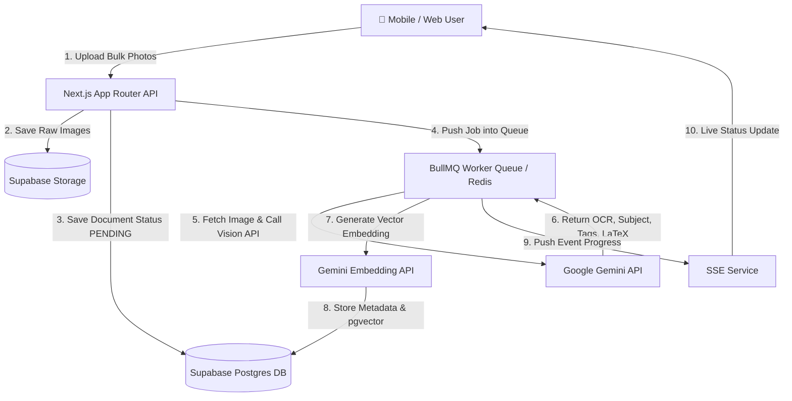

# 📚 StudySnap AI — Smart Textbook & Lecture Photo Organizer

> **Giải pháp quản lý, trích xuất và biến ảnh chụp giáo trình/bảng viết/slide bài giảng thành kho tri thức thông minh cho Học sinh & Sinh viên.**

[](https://nextjs.org/)
[](https://supabase.com/)
[](https://ai.google.dev/)
[](https://bullmq.io/)
[](https://www.typescriptlang.org/)
[](LICENSE)

---

## 🎯 Vấn Đề (The Pain Point)

Học sinh, sinh viên thường xuyên dùng điện thoại chụp lại:
- **Slide bài giảng** trên lớp.
- **Trang sách / giáo trình / đề thi**.
- **Ghi chú trên bảng đen / bảng trắng** của giảng viên.
- **Bài giải bài tập viết tay** của bạn bè.

👉 **Hậu quả:** Hàng trăm ảnh học tập bị lẫn lộn rối loạn với ảnh chụp cá nhân, meme, đồ ăn trong Album ảnh điện thoại. Đến kỳ thi, việc tìm lại một công thức hay một slide đã chụp từ 3 tuần trước trở thành **ác mộng**.

---

## 💡 Giải Pháp (The Solution)

**StudySnap AI** tái cấu trúc hoàn toàn trải nghiệm lưu trữ bài học bằng trí tuệ nhân tạo:
1. **Tự động phân loại:** AI nhận diện môn học (Giải tích, Vật lý, Triết học, v.v.), loại tài liệu (Slide, Bảng viết, Sách, Đề thi) và tạo tiêu đề/thẻ tự động.
2. **OCR Multimodal siêu chính xác:** Trích xuất công thức toán học dạng **LaTeX**, bảng biểu dạng **Markdown**, và chữ viết tay.
3. **Tìm kiếm ngữ nghĩa (Semantic RAG Search):** Tìm theo khái niệm thay vì chỉ tìm từ khóa chính xác (VD: gõ "bài tập đạo hàm" sẽ ra đúng ảnh chứa bài tập đó).
4. **Hỏi đáp & Tạo Flashcard với AI:** Chat trực tiếp với tập ảnh giáo trình, tự tạo thẻ ghi nhớ (Anki/Flashcards) và câu hỏi trắc nghiệm ôn tập.

---

## 🚀 Công Nghệ Sử Dụng (Tech Stack)

Tận dụng và phát huy tối đa kiến thức kỹ thuật hiện có:

| Tầng (Layer) | Công nghệ | Vai trò & Lý do lựa chọn |
| :--- | :--- | :--- |
| **Frontend** | **Next.js 14 (App Router) + React + Tailwind CSS** | Server Components tối ưu SEO, UI/UX hiện đại, giao diện PWA mượt mà trên Mobile & Desktop |
| **Database & Auth** | **Supabase (PostgreSQL + pgvector)** | Authentication (Google/Email), RLS bảo mật dữ liệu người dùng, lưu trữ Vector Embeddings để tìm kiếm ngữ nghĩa |
| **File Storage** | **Supabase Storage** | Lưu trữ ảnh gốc, ảnh nén thumbnail và tài liệu trích xuất |
| **AI Vision & NLP** | **Google Gemini 1.5 / 2.0 Flash Vision API** | Nhận diện hình ảnh đa thức (Multimodal), OCR công thức LaTeX, trích xuất cấu trúc văn bản & tóm tắt bài học |
| **Async Pipeline** | **BullMQ + Redis** | Hàng chờ xử lý bất đồng bộ khi sinh viên tải lên hàng loạt 20-50 ảnh cùng lúc sau buổi học |
| **Realtime Feedback** | **Server-Sent Events (SSE)** | Cập nhật tiến độ xử lý ảnh theo thời gian thực lên giao diện người dùng ("Đang phân loại 3/20...", "Hoàn tất") |

---

## 🏗️ Kiến Trúc Hệ Thống (System Architecture)



---

## ✨ Tính Năng Nổi Bật (Key Features)

### 1. 📷 Tải Lên Hàng Loạt & Phân Loại Tự Động (Batch Upload & Auto-Categorization)
- Tải lên cùng lúc nhiều ảnh chụp từ lớp học.
- AI Gemini tự động quét và phân môn học (Calculus, Physics, Organic Chemistry...), chương bài học và loại tài liệu.

### 2. 🔤 OCR Công Thức LaTeX & Chữ Viết Tay (Formula & Handwriting Extraction)
- Nhận diện công thức phức tạp thành định dạng LaTeX chuẩn: `\int_{a}^{b} f(x)dx`.
- Trích xuất bảng dữ liệu thành Markdown Table.
- Hỗ trợ chữ viết tay tiếng Việt và tiếng Anh.

### 3. 🔍 Tìm Kiếm Thông Minh (Semantic Search with pgvector)
- Tìm kiếm nội dung ảnh theo ý nghĩa bài học thay vì tên file.
- Ví dụ: Tìm "Đồ thị dao động điều hòa" -> Hệ thống truy vấn Vector Similarity trong Supabase và trả về chính xác ảnh bài giảng liên quan.

### 4. 🧠 Chat Với Giáo Trình & Tự Tạo Bài Ôn Luyện (AI Study Assistant)
- **Ask AI:** "Giải thích từng bước bài giải trong ảnh này cho mình".
- **Auto Flashcards:** Tự chuyển đổi các định nghĩa/công thức trong ảnh thành bộ thẻ ghi nhớ Flashcards (xuất file Anki hoặc học trực tiếp trên app).
- **Quiz Generator:** Tự tạo 5 câu hỏi trắc nghiệm kiểm tra kiến thức dựa trên nội dung ảnh vừa chụp.

---

## 🗄️ Thiết Kế Cơ Sở Dữ Liệu (Database Schema Preview)

```sql
-- Thư mục môn học
CREATE TABLE subjects (
  id UUID PRIMARY KEY DEFAULT gen_random_uuid(),
  user_id UUID REFERENCES auth.users(id) ON DELETE CASCADE,
  name TEXT NOT NULL, -- e.g. "Giải tích 1", "Vật lý đại cương"
  color_code TEXT,
  created_at TIMESTAMPTZ DEFAULT NOW()
);

-- Tài liệu / Bộ ảnh
CREATE TABLE documents (
  id UUID PRIMARY KEY DEFAULT gen_random_uuid(),
  user_id UUID REFERENCES auth.users(id) ON DELETE CASCADE,
  subject_id UUID REFERENCES subjects(id) ON DELETE SET NULL,
  title TEXT NOT NULL,
  doc_type TEXT, -- 'slide', 'textbook', 'whiteboard', 'exam', 'notes'
  summary TEXT,
  status TEXT DEFAULT 'pending', -- 'pending', 'processing', 'completed', 'failed'
  created_at TIMESTAMPTZ DEFAULT NOW()
);

-- Trang ảnh & Kết quả OCR Gemini
CREATE TABLE document_pages (
  id UUID PRIMARY KEY DEFAULT gen_random_uuid(),
  document_id UUID REFERENCES documents(id) ON DELETE CASCADE,
  page_number INT NOT NULL,
  image_url TEXT NOT NULL,
  ocr_raw_text TEXT,
  ocr_markdown TEXT,
  latex_formulas JSONB,
  embedding vector(768), -- pgvector cho Semantic Search
  created_at TIMESTAMPTZ DEFAULT NOW()
);
```

---

## 🛠️ Hướng Dẫn Cài Đặt Cục Bộ (Local Setup Guide)

### 1. Prerequisite (Yêu cầu môi trường)
- Node.js >= 18.x
- Docker & Docker Compose (cho Redis)
- Tài khoản Supabase & Google AI Studio (Gemini API Key)

### 2. Clone Repository
```bash
git clone https://github.com/kiet-w/study.git
cd study
```

### 3. Cấu hình biến môi trường (`.env.local`)
```env
# Next.js
NEXT_PUBLIC_APP_URL=http://localhost:3000

# Supabase
NEXT_PUBLIC_SUPABASE_URL=https://your-supabase-project.supabase.co
NEXT_PUBLIC_SUPABASE_ANON_KEY=your-supabase-anon-key
SUPABASE_SERVICE_ROLE_KEY=your-supabase-service-role-key

# Google Gemini API
GEMINI_API_KEY=your-gemini-api-key

# Redis & BullMQ
REDIS_HOST=localhost
REDIS_PORT=6379
REDIS_PASSWORD=
```

### 4. Khởi chạy Redis & Cài đặt Dependencies
```bash
# Chạy Redis bằng Docker
docker run -d --name study-redis -p 6379:6379 redis:alpine

# Cài đặt gói phụ thuộc
npm install
# hoặc
pnpm install
```

### 5. Khởi chạy Ứng dụng & Worker Process
```bash
# Terminal 1: Run Next.js Dev Server
npm run dev

# Terminal 2: Run BullMQ Worker (Xử lý ảnh background)
npm run worker
```

---

## 🗺️ Lộ Trình Phát Triển (Roadmap)

- [x] **Giai đoạn 1: Architecture & Pipeline Design** (Thiết kế database, cấu hình BullMQ + Gemini Vision)
- [ ] **Giai đoạn 2: MVP Core** (Tải ảnh, Phân loại môn học tự động, Trích xuất OCR LaTeX)
- [ ] **Giai đoạn 3: RAG & Search** (Tích hợp Supabase pgvector, Tìm kiếm ngữ nghĩa)
- [ ] **Giai đoạn 4: Smart Assistant** (Hỏi đáp AI với ảnh giáo trình, Tự sinh Flashcards/Quiz)
- [ ] **Giai đoạn 5: Mobile PWA & Offline Support** (Tối ưu trải nghiệm chụp ảnh trên smartphone)

---

## 📝 License

Dự án được phân phối dưới giấy phép [MIT License](LICENSE).
