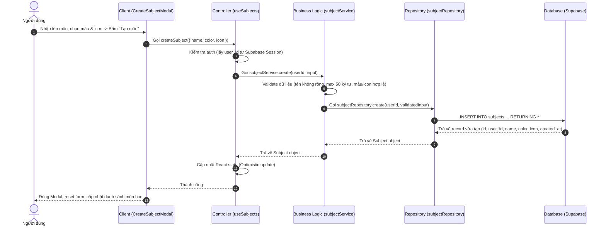

# 🏗️ Implementation Plan: Create Subject Flow

## 1. Luồng Xử Lý (Sequence Flow)

Luồng thực thi khi người dùng tạo môn học mới:

---

## 2. Các File Sẽ Tạo (Files to Create)

| Layer | Đường dẫn | Trách nhiệm chính |
|:---|:---|:---|
| **Database** | `supabase/migrations/20260809_subjects.sql` | Schema bảng `subjects` + Bật RLS Policies |
| **Types** | `src/types/index.ts` | Khai báo `Subject` và `CreateSubjectInput` interfaces |
| **Config** | `src/lib/supabase.ts` | Singleton Client khởi tạo Supabase |
| **Constants** | `src/lib/constants.ts` | Danh sách màu mẫu (`COLOR_OPTIONS`), icon (`ICON_OPTIONS`) |
| **Repository** | `src/lib/subjectRepository.ts` | Thao tác trực tiếp với Supabase Database (`INSERT INTO subjects`) |
| **Service** | `src/lib/subjectService.ts` | Xử lý logic nghiệp vụ & validate input |
| **Controller** | `src/hooks/useSubjects.ts` | Quản lý state React, gọi service, bắt lỗi UI |
| **UI Component** | `src/components/CreateSubjectModal.tsx` | Giao diện Bottom Sheet Form nhập thông tin môn học |

---

## 3. Phân Công Subagent Chạy Song Song

Để tối ưu thời gian phát triển, 5 subagents độc lập sẽ cùng làm việc:

* **Subagent 1 (DB & Types):** Tạo `20260809_subjects.sql` & `src/types/index.ts`
* **Subagent 2 (Lib Config):** Tạo `src/lib/supabase.ts` & `src/lib/constants.ts`
* **Subagent 3 (Backend Logic):** Tạo `src/lib/subjectRepository.ts` & `src/lib/subjectService.ts`
* **Subagent 4 (State & Hook):** Tạo `src/hooks/useSubjects.ts`
* **Subagent 5 (UI Component):** Tạo `src/components/CreateSubjectModal.tsx`

---

## 4. Kế Hoạch Kiểm Thử (Verification Plan)

1. **Automated Checks:**
   - Chạy `npx tsc --noEmit` để đảm bảo không lỗi kiểu dữ liệu (TypeScript type checking).
2. **Manual Verification:**
   - Mở modal tạo môn → Kiểm tra validation (để trống tên, chọn màu/icon).
   - Bấm Submit → Kiểm tra record trong Supabase & danh sách môn học tự động re-render.
